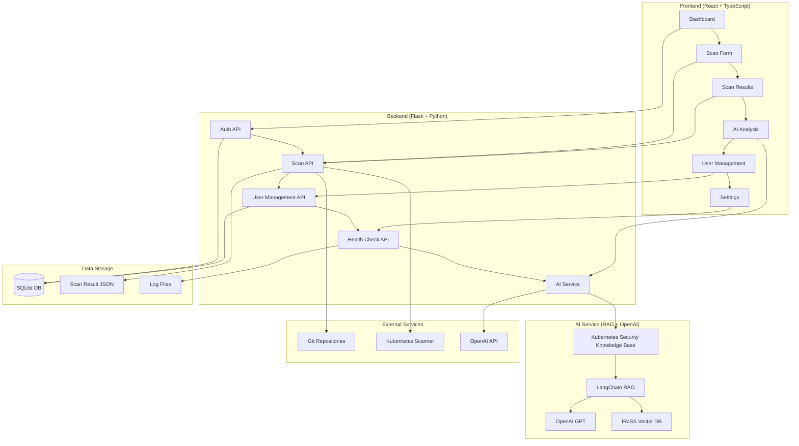

# 🚀 Kubee Web - Kubernetes Security Scanning Platform

<div align="center">


**A comprehensive web-based platform for automatically scanning Kubernetes configuration files for security vulnerabilities and providing AI-powered analysis**

[Features](#-key-features) • [Installation](#-installation--setup) • [API Documentation](#-api-documentation) • [AI Features](#-ai-features) • [Deployment Guide](#-deployment-guide)

**📖 English Documentation | [한국어 문서](README_KO.md)**

</div>

---

## 📋 Table of Contents

- [Project Overview](#-project-overview)
- [Key Features](#-key-features)
- [System Architecture](#-system-architecture)
- [Installation & Setup](#-installation--setup)
- [API Documentation](#-api-documentation)
- [AI Features](#-ai-features)
- [Security Rules](#-security-rules)
- [User Roles](#-user-roles)
- [Deployment Guide](#-deployment-guide)
- [Project Structure](#-project-structure)
- [Contributing](#-contributing)
- [License](#-license)

---

## 🎯 Project Overview

**Kubee Web** is a comprehensive security scanning platform designed to enhance the security of Kubernetes clusters. It automatically analyzes Kubernetes configuration files from Git repositories to identify potential security vulnerabilities and provides AI-powered analysis with detailed reports.

### 🌟 Core Values

- **🔍 Automated Security Scanning**: Automatically clones Git repositories and analyzes Kubernetes configuration files
- **🤖 AI-Powered Analysis**: Intelligent security analysis and recommendations using RAG models
- **📊 Real-time Dashboard**: Monitor scan statistics, issue distribution, and trend analysis at a glance
- **🔐 Enhanced Authentication System**: JWT-based authentication, role-based access control, and session management
- **📤 Multiple Report Formats**: Export scan results in CSV and JSON formats
- **⚙️ User Customization**: Personalized notifications, UI, and security settings

---

## 🎥 시연영상

Kubee Web의 주요 기능과 사용법을 확인해보세요:

[](https://youtu.be/VP6hipB-tmU)

*클릭하여 YouTube에서 시연영상 보기*

---

## ✨ Key Features

### 🔍 **Scanning & Analysis**
- **Git Repository Scanning**: Support for GitHub, GitLab, and other Git hosting services
- **Multi-format Support**: YAML, JSON, Helm Charts, Kustomize
- **Real-time Scan Progress**: Live display of scan status and progress
- **Deep Scan Option**: Advanced scanning mode for detailed analysis
- **Severity Classification**: Automatic classification of Critical, High, Medium, Low issues

### 🤖 **AI-Powered Analysis**
- **RAG Model**: Question-answering based on Kubernetes security knowledge base
- **Scan Result Analysis**: AI analyzes scan results and suggests priorities
- **Exploit Scenarios**: Detailed attack methods for discovered vulnerabilities
- **Security Recommendations**: AI-based customized remediation recommendations
- **Natural Language Queries**: Free-form questions and answers about Kubernetes security
- **Enhanced AI Interface**: New AI analysis component with improved user experience
- **Knowledge Base Integration**: Comprehensive Kubernetes security knowledge base

### 📊 **Dashboard & Statistics**
- **Real-time Dashboard**: Overview of entire system status at a glance
- **Scan Statistics**: Total scans, detected misconfigurations, user activity
- **Severity Distribution**: Visualization of Critical, High, Medium, Low misconfiguration distribution
- **Monthly Statistics**: Analysis of scan and misconfiguration trends
- **Detailed Statistics**: Frequency and detailed information by misconfiguration type
- **Advanced Statistics Tab**: Comprehensive statistical analysis with charts and graphs
- **Misconfiguration Analytics**: Deep dive into security issues and patterns

### 🔐 **Authentication & User Management**
- **JWT-based Authentication**: Secure token-based authentication system
- **Role-based Access Control**: Admin, User role-based permission management
- **User Management**: User addition, deletion, role changes (Admin only)
- **Session Management**: Auto-logout, session timeout settings

### 📤 **Reports & Export**
- **CSV Export**: Download scan results in spreadsheet format
- **JSON Reports**: Structured reports with detailed metadata
- **Real-time Export**: Generate reports immediately after scan completion

### ⚙️ **Settings & Customization**
- **Dark Mode Theme**: Modern dark theme UI
- **Personal Settings**: Theme, language, items per page UI settings
- **Scan Settings**: Auto-scan, Deep Scan defaults, concurrent scan limits
- **Security Settings**: Session timeout, password policies
- **User Guide**: Role-based comprehensive user guide and documentation
- **Advanced Settings Page**: Detailed configuration options for power users

---

## 🏗️ System Architecture



### 🔧 Technology Stack

**Frontend:**
- React 19.1.1 + TypeScript 4.9.5
- Material-UI 7.3.2 (Component Library)
- Axios 1.12.2 (HTTP Client)
- React Router 7.9.3 (Routing)
- Recharts 3.2.1 (Chart Library)
- @mui/x-data-grid 8.12.1 (Advanced Data Grid)
- @mui/x-date-pickers 8.12.0 (Date Picker Components)
- dayjs 1.11.18 (Date Library)

**Backend:**
- Flask 3.0.0 (Web Framework)
- SQLite (Database)
- JWT (Authentication)
- bcrypt (Password Hashing)

**AI Service:**
- LangChain (RAG Framework)
- OpenAI GPT (Language Model)
- FAISS (Vector Database)
- sentence-transformers (Text Embeddings)
- langchain-text-splitters (Text Processing)

**DevOps:**
- Docker + Docker Compose
- Git (Version Control)
- pytest (Testing)

---

## 🚀 Installation & Setup

### 📋 Prerequisites

- Python 3.8+
- Node.js 16+
- Git
- OpenAI API Key (for AI features)
- Docker (optional)

### 🔧 Local Development Environment Setup

#### 1. Clone Repository
```bash
git clone <repository-url>
cd kubee_web
```

#### 2. Python Virtual Environment Setup
```bash
# Create virtual environment
python -m venv venv

# Activate virtual environment
source venv/bin/activate  # Linux/Mac
# or
venv\Scripts\activate     # Windows

# Install dependencies
pip install -r requirements.txt
```

#### 3. Environment Variables Setup
```bash
# Create environment variables file
cp env.example .env

# Edit .env file (required settings)
nano .env
```

**Required Settings:**
```bash
# OpenAI API Key (for AI features)
OPENAI_API_KEY=sk-your-actual-openai-api-key-here

# JWT Secret Key (security)
JWT_SECRET_KEY=your-super-secret-jwt-key-change-this-in-production

# Admin Account (change in production!)
ADMIN_PASSWORD=your-secure-admin-password
```

#### 4. Database Initialization
```bash
# Database is automatically initialized when backend server starts
# No separate initialization command needed
```

#### 5. Start Backend Server
```bash
cd backend/api
python server.py
```

#### 6. Start Frontend
```bash
cd frontend
npm install
npm start
```

### 🚀 Quick Start with Shell Scripts

Kubee Web provides convenient shell scripts:

#### 📋 Available Scripts

| Script | Function | Description |
|--------|----------|-------------|
| `./start.sh` | Start Services | Automatically start frontend and backend in background |
| `./stop.sh` | Stop Services | Safely stop all running services |
| `./dev.sh` | Development Mode | Start in development mode (real-time log output) |
| `./status.sh` | Check Status | Check current service status in detail |

#### 🚀 Quick Start

```bash
# 1. Start services
./start.sh

# 2. Check status
./status.sh

# 3. Stop services
./stop.sh
```

#### 🛠️ Development Mode

```bash
# Start in development mode (real-time log output)
./dev.sh

# Stop with Ctrl+C
```

### 🐳 Docker Setup

```bash
# Run entire stack with Docker Compose
docker-compose up -d

# Check logs
docker-compose logs -f

# Stop services
docker-compose down
```

### 🌐 Access Information

- **Frontend**: http://localhost:3000
- **Backend API**: http://localhost:8282
- **Health Check**: http://localhost:8282/health

### 👤 Default Account Information

| Username | Password | Role | Description |
|----------|----------|------|-------------|
| admin | admin123 | admin | System Administrator |
| user | user123 | user | General User |

> ⚠️ **Security Note**: Change default passwords in production environment!

---

## 📚 API Documentation

### 🔐 Authentication API

#### Login
```http
POST /auth/login
Content-Type: application/json

{
  "username": "admin",
  "password": "admin123"
}
```

#### Register
```http
POST /auth/register
Content-Type: application/json

{
  "username": "newuser",
  "email": "user@example.com",
  "password": "password123",
  "role": "user"
}
```

#### Logout
```http
POST /auth/logout
Authorization: Bearer <token>
```

### 🔍 Scan API

#### Repository Scan
```http
POST /api/scan
Authorization: Bearer <token>
Content-Type: application/json

{
  "repo_url": "https://github.com/user/repo",
  "deep_scan": true
}
```

#### Get Scan Results
```http
GET /api/results
Authorization: Bearer <token>
```

#### Get Scan Logs
```http
GET /api/scan-logs
Authorization: Bearer <token>
```

### 🤖 AI API

#### AI Chat
```http
POST /api/ai/chat
Authorization: Bearer <token>
Content-Type: application/json

{
  "message": "Kubernetes 보안에 대한 질문",
  "scan_results": [scan_result_data],
  "context": {}
}
```

#### Analyze Scan Results
```http
POST /api/ai/analyze-scan
Authorization: Bearer <token>
Content-Type: application/json

{
  "scan_results": [scan_result_data]
}
```

#### Get AI Status
```http
GET /api/ai/status
Authorization: Bearer <token>
```

### 👥 User Management API (Admin Only)

#### Get User List
```http
GET /api/users
Authorization: Bearer <admin_token>
```

#### Create User
```http
POST /api/users
Authorization: Bearer <admin_token>
Content-Type: application/json

{
  "username": "newuser",
  "email": "user@example.com",
  "password": "password123",
  "role": "user"
}
```

#### Delete User
```http
DELETE /api/users/<username>
Authorization: Bearer <admin_token>
```

### 🏥 Health Check API

#### System Status
```http
GET /health
```

---

## 🤖 AI Features

### 💬 **General Security Questions**
Provides free-form questions and answers about Kubernetes security.

**Example Questions:**
- "What are the risks of privileged containers in Kubernetes?"
- "Please explain Pod Security Standards."
- "How should I configure network policies?"

### 🔍 **Scan Result Analysis**
Select stored scan results for AI analysis and priority suggestions.

**Analysis Content:**
- Severity assessment of discovered vulnerabilities
- Remediation priority suggestions
- Business impact analysis
- Remediation difficulty assessment

### ⚠️ **Exploit Scenarios**
Explains specific attack methods based on vulnerabilities in selected scan results.

**Provided Information:**
- Real vulnerability-based scenarios
- Specific attack steps
- Tools and commands used
- Expected attack outcomes
- Defense and mitigation methods

### 🛡️ **Security Recommendations**
Provides customized remediation recommendations based on selected scan results.

**Recommendation Content:**
- Specific remediation methods
- Code examples
- Best practice guides
- Additional security hardening measures

---

## 🛡️ Security Rules

### 📋 Scan Target Rules

#### 1. **Network Security**
- Prohibition of `hostNetwork: true`
- Risk assessment when using `hostPort`
- Detection of unnecessary port exposure

#### 2. **Permissions & Security Context**
- Prohibition of `privileged: true`
- Prohibition of `runAsUser: 0` (root user)
- Prohibition of `allowPrivilegeEscalation: true`

#### 3. **Resource Management**
- Detection of missing CPU/memory limits
- Detection of excessive resource requests

#### 4. **Image Security**
- Prohibition of `latest` tag usage
- Recommendation of official images
- Integration with image vulnerability scanning

#### 5. **Secret Management**
- Detection of hardcoded secrets
- Proper use of ConfigMap and Secret
- Prevention of sensitive information exposure

### 🔍 Severity Classification

| Severity | Description | Examples |
|----------|-------------|----------|
| **Critical** | Immediate fix required | `privileged: true`, `hostNetwork: true` |
| **High** | High priority | `runAsUser: 0`, hardcoded secrets |
| **Medium** | Medium priority | Missing resource limits, `latest` tag |
| **Low** | Low priority | Recommendations, best practice violations |

---

## 👥 User Roles

### 🔑 **Admin (Administrator)**
- **Full System Management**: Access to all features
- **User Management**: Add, delete, change user roles
- **System Settings**: Global settings and security policy management
- **Monitoring**: System status and log monitoring

**Accessible Features:**
- ✅ All scan features
- ✅ User management (add, delete, role changes)
- ✅ Scan logs and history
- ✅ All reports and statistics
- ✅ AI analysis features

### 👤 **User (General User)**
- **Basic Scanning**: Repository scanning and result viewing
- **Personal Settings**: Personalized setting management
- **Limited Access**: Restricted access to security-related advanced features

**Accessible Features:**
- ✅ Basic scan features
- ✅ Scan result viewing
- ✅ Personal settings
- ✅ Basic reports
- ✅ AI analysis features
- ❌ User management
- ❌ Scan logs

---

## 🚀 Deployment Guide

### 🐳 Docker Deployment

#### 1. Build Docker Images
```bash
# Build entire application
docker build -t kubee-web:latest .

# Build individual services
docker build -f Dockerfile.backend -t kubee-backend:latest .
docker build -f Dockerfile.frontend -t kubee-frontend:latest .
```

#### 2. Run with Docker Compose
```bash
# Production environment setup
export JWT_SECRET_KEY="your-super-secret-key"
export OPENAI_API_KEY="your-openai-api-key"
export ADMIN_PASSWORD="secure-admin-password"

# Start services
docker-compose -f docker-compose.prod.yml up -d
```

### ☸️ Kubernetes Deployment

#### 1. Create Namespace
```bash
kubectl create namespace kubee-web
```

#### 2. Create Secrets
```bash
kubectl create secret generic kubee-secrets \
  --from-literal=jwt-secret-key="your-super-secret-key" \
  --from-literal=openai-api-key="your-openai-api-key" \
  --from-literal=admin-password="secure-admin-password" \
  -n kubee-web
```

#### 3. Deploy
```bash
kubectl apply -f k8s/ -n kubee-web
```

### 🔧 Environment Variables

| Variable | Description | Default | Required |
|----------|-------------|---------|----------|
| `JWT_SECRET_KEY` | JWT token signing key | `super-secret-key` | ✅ |
| `OPENAI_API_KEY` | OpenAI API key | - | ✅ (for AI features) |
| `ADMIN_PASSWORD` | Default admin password | `admin123` | ❌ |
| `APP_HOST` | Server host | `0.0.0.0` | ❌ |
| `APP_PORT` | Server port | `8282` | ❌ |
| `APP_DEBUG` | Debug mode | `false` | ❌ |

---

## 📁 Project Structure

```
kubee_web/
├── 📁 backend/                    # Flask Backend
│   ├── 📁 api/                   # API Server
│   │   └── server.py             # Flask Server
│   └── 📁 k8s-misconfiguration/  # K8s Scanner
│       └── 📁 services/
│           ├── scan_service.py   # Scan Service
│           └── repo_service.py   # Repository Service
├── 📁 frontend/                   # React Frontend
│   ├── 📁 src/
│   │   ├── 📁 components/        # React Components
│   │   ├── 📁 contexts/         # React Context
│   │   ├── 📁 services/         # API Services
│   │   └── 📁 types/            # TypeScript Types
│   ├── package.json
│   └── public/
├── 📁 ai_services/               # AI Services
│   └── simple_ai.py             # LangChain RAG-based AI Service
├── 📁 ai_knowledge/              # AI Knowledge Base
│   └── kubernetes_security_knowledge.md
├── 📁 logs/                      # Log Files Directory
├── 📄 start.sh                   # Service Start Script
├── 📄 stop.sh                    # Service Stop Script
├── 📄 dev.sh                     # Development Mode Script
├── 📄 status.sh                  # Status Check Script
├── 📄 docker-compose.yml         # Docker Compose Configuration
├── 📄 Dockerfile                 # Docker Image Build
├── 📄 requirements.txt           # Python Dependencies
├── 📄 ai_requirements.txt        # AI Dependencies
├── 📄 README.md                  # Project Documentation (English)
├── 📄 README_KO.md               # Project Documentation (Korean)
└── 📄 .gitignore                # Git Ignore File
```

---

## 🤝 Contributing

### 🔧 Development Environment Setup

1. **Fork** the repository
2. **Create Feature Branch**: `git checkout -b feature/amazing-feature`
3. **Commit Changes**: `git commit -m 'Add amazing feature'`
4. **Push Branch**: `git push origin feature/amazing-feature`
5. **Create Pull Request**

### 📝 Coding Style

- **Python**: Follow PEP 8
- **TypeScript**: Use ESLint + Prettier configuration
- **Commit Messages**: Use Conventional Commits format

### 🧪 Testing

```bash
# Backend testing
cd backend
python -m pytest tests/ -v

# Frontend testing
cd frontend
npm test
```

---

## 📄 License

This project is distributed under the MIT License. See the [LICENSE](LICENSE) file for details.

---

## 🙏 Acknowledgments

- [Kubernetes](https://kubernetes.io/) - Container orchestration platform
- [React](https://reactjs.org/) - User interface library
- [Flask](https://flask.palletsprojects.com/) - Web framework
- [Material-UI](https://mui.com/) - React component library
- [LangChain](https://langchain.com/) - RAG framework
- [OpenAI](https://openai.com/) - AI language model

---

<div align="center">

**Enhance your Kubernetes security with Kubee Web!** 🚀

[⭐ Star](https://github.com/your-repo/kubee-web) • [🐛 Issues](https://github.com/your-repo/kubee-web/issues) • [💬 Discussions](https://github.com/your-repo/kubee-web/discussions)

</div>
