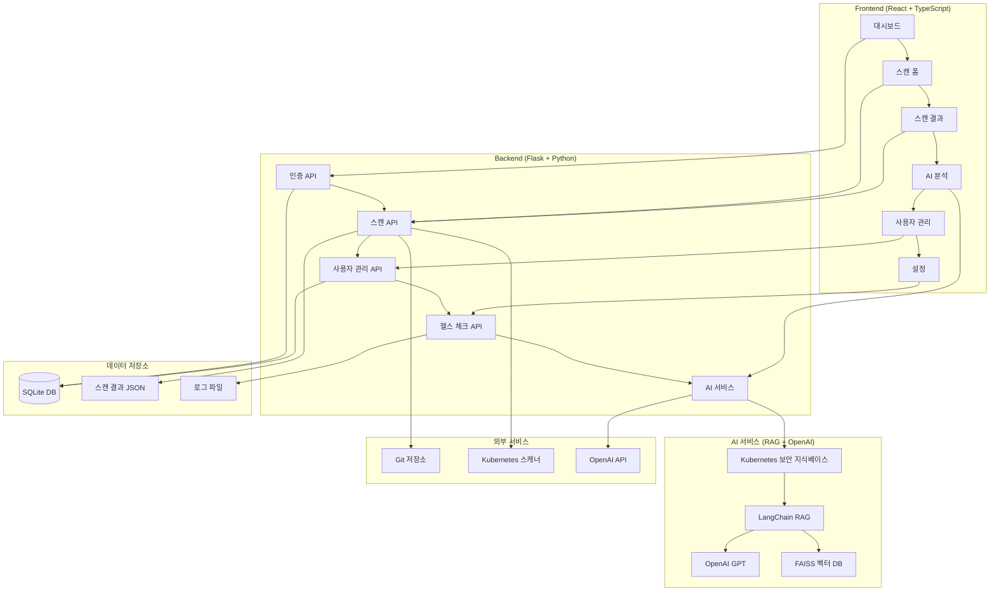

# 🚀 Kubee Web - Kubernetes 보안 스캔 플랫폼

<div align="center">


**Kubernetes 설정 파일의 보안 취약점을 자동으로 스캔하고 AI 기반 분석을 제공하는 웹 기반 플랫폼**

[기능 소개](#-주요-기능) • [설치 가이드](#-설치-및-실행) • [API 문서](#-api-문서) • [AI 기능](#-ai-기능) • [배포 가이드](#-배포-가이드)

**📖 [English Documentation](README.md) | 한국어 문서**

</div>

---

## 📋 목차

- [프로젝트 소개](#-프로젝트-소개)
- [주요 기능](#-주요-기능)
- [시스템 아키텍처](#-시스템-아키텍처)
- [설치 및 실행](#-설치-및-실행)
- [API 문서](#-api-문서)
- [AI 기능](#-ai-기능)
- [보안 규칙](#-보안-규칙)
- [사용자 역할](#-사용자-역할)
- [배포 가이드](#-배포-가이드)
- [프로젝트 구조](#-프로젝트-구조)
- [기여하기](#-기여하기)
- [라이선스](#-라이선스)

---

## 🎯 프로젝트 소개

**Kubee Web**은 Kubernetes 클러스터의 보안을 강화하기 위해 설계된 종합적인 보안 스캔 플랫폼입니다. Git 저장소의 Kubernetes 설정 파일들을 자동으로 분석하여 잠재적인 보안 취약점을 식별하고, AI 기반 분석과 상세한 보고서를 제공합니다.

### 🌟 핵심 가치

- **🔍 자동화된 보안 스캔**: Git 저장소를 자동으로 클론하고 Kubernetes 설정 파일을 분석
- **🤖 AI 기반 분석**: RAG 모델을 활용한 지능형 보안 분석 및 권장사항 제공
- **📊 실시간 대시보드**: 스캔 통계, 문제 분포, 트렌드 분석을 한눈에 확인
- **🔐 강화된 인증 시스템**: JWT 기반 인증, 역할 기반 접근 제어, 세션 관리
- **📤 다양한 보고서 형식**: CSV, JSON 형식으로 스캔 결과 내보내기
- **⚙️ 사용자 맞춤 설정**: 개인화된 알림, UI, 보안 설정

---

## 🎥 시연영상

Kubee Web의 주요 기능과 사용법을 확인해보세요:

[](https://youtu.be/VP6hipB-tmU)

*클릭하여 YouTube에서 시연영상 보기*

---

## ✨ 주요 기능

### 🔍 **스캔 및 분석**
- **Git 저장소 스캔**: GitHub, GitLab 등 다양한 Git 호스팅 서비스 지원
- **다중 파일 형식 지원**: YAML, JSON, Helm Charts, Kustomize
- **실시간 스캔 진행률**: 스캔 상태와 진행률을 실시간으로 표시
- **Deep Scan 옵션**: 더 상세한 분석을 위한 고급 스캔 모드
- **심각도별 분류**: Critical, High, Medium, Low 문제 자동 분류

### 🤖 **AI 기반 분석**
- **RAG 모델**: Kubernetes 보안 지식베이스 기반 질의응답
- **스캔 결과 분석**: AI가 스캔 결과를 분석하고 우선순위 제안
- **익스플로잇 시나리오**: 발견된 취약점의 구체적인 공격 방법 설명
- **보안 권장사항**: AI 기반 맞춤형 수정 권장사항 제공
- **자연어 질의**: Kubernetes 보안에 대한 자유로운 질문과 답변
- **향상된 AI 인터페이스**: 개선된 사용자 경험을 제공하는 새로운 AI 분석 컴포넌트
- **지식베이스 통합**: 포괄적인 Kubernetes 보안 지식베이스

### 📊 **대시보드 및 통계**
- **실시간 대시보드**: 전체 시스템 현황을 한눈에 파악
- **스캔 통계**: 총 스캔 수, 탐지된 미스컨피그레이션 수, 사용자 활동
- **심각도별 분포**: Critical, High, Medium, Low 미스컨피그레이션 분포 시각화
- **월별 통계**: 스캔 및 미스컨피그레이션 추이 분석
- **상세 통계**: 미스컨피그레이션 유형별 빈도 및 상세 정보
- **고급 통계 탭**: 차트와 그래프를 포함한 포괄적인 통계 분석
- **미스컨피그레이션 분석**: 보안 문제와 패턴에 대한 심층 분석

### 🔐 **인증 및 사용자 관리**
- **JWT 기반 인증**: 안전한 토큰 기반 인증 시스템
- **역할 기반 접근 제어**: Admin, User 역할별 권한 관리
- **사용자 관리**: 사용자 추가, 삭제, 역할 변경 (Admin 전용)
- **세션 관리**: 자동 로그아웃, 세션 타임아웃 설정

### 📤 **보고서 및 내보내기**
- **CSV 내보내기**: 스캔 결과를 스프레드시트 형식으로 다운로드
- **JSON 보고서**: 상세한 메타데이터와 함께 구조화된 보고서
- **실시간 내보내기**: 스캔 완료 즉시 보고서 생성 가능

### ⚙️ **설정 및 커스터마이징**
- **다크 모드 테마**: 현대적인 다크 테마 UI
- **개인 설정**: 테마, 언어, 페이지당 항목 수 등 UI 설정
- **스캔 설정**: 자동 스캔, Deep Scan 기본값, 동시 스캔 수 제한
- **보안 설정**: 세션 타임아웃, 비밀번호 정책
- **사용자 가이드**: 역할별 포괄적인 사용자 가이드 및 문서
- **고급 설정 페이지**: 고급 사용자를 위한 상세한 구성 옵션

---

## 🏗️ 시스템 아키텍처



### 🔧 기술 스택

**Frontend:**
- React 19.1.1 + TypeScript 4.9.5
- Material-UI 7.3.2 (컴포넌트 라이브러리)
- Axios 1.12.2 (HTTP 클라이언트)
- React Router 7.9.3 (라우팅)
- Recharts 3.2.1 (차트 라이브러리)
- @mui/x-data-grid 8.12.1 (고급 데이터 그리드)
- @mui/x-date-pickers 8.12.0 (날짜 선택 컴포넌트)
- dayjs 1.11.18 (날짜 라이브러리)

**Backend:**
- Flask 3.0.0 (웹 프레임워크)
- SQLite (데이터베이스)
- JWT (인증)
- bcrypt (비밀번호 해싱)

**AI 서비스:**
- LangChain (RAG 프레임워크)
- OpenAI GPT (언어 모델)
- FAISS (벡터 데이터베이스)
- sentence-transformers (텍스트 임베딩)
- langchain-text-splitters (텍스트 처리)

**DevOps:**
- Docker + Docker Compose
- Git (버전 관리)
- pytest (테스트)

---

## 🚀 설치 및 실행

### 📋 사전 요구사항

- Python 3.8+
- Node.js 16+
- Git
- OpenAI API 키 (AI 기능 사용 시)
- Docker (선택사항)

### 🔧 로컬 개발 환경 설정

#### 1. 저장소 클론
```bash
git clone <repository-url>
cd kubee_web
```

#### 2. Python 가상환경 설정
```bash
# 가상환경 생성
python -m venv venv

# 가상환경 활성화
source venv/bin/activate  # Linux/Mac
# 또는
venv\Scripts\activate     # Windows

# 의존성 설치
pip install -r requirements.txt
```

#### 3. 환경 변수 설정
```bash
# 환경 변수 파일 생성
cp env.example .env

# .env 파일 편집 (필수 설정 항목)
nano .env
```

**필수 설정 항목:**
```bash
# OpenAI API 키 (AI 기능 사용 시)
OPENAI_API_KEY=sk-your-actual-openai-api-key-here

# JWT 시크릿 키 (보안)
JWT_SECRET_KEY=your-super-secret-jwt-key-change-this-in-production

# 관리자 계정 (프로덕션에서는 반드시 변경!)
ADMIN_PASSWORD=your-secure-admin-password
```


#### 4. 데이터베이스 초기화
```bash
# 백엔드 서버 실행 시 자동으로 데이터베이스가 초기화됩니다
# 별도의 초기화 명령어는 필요하지 않습니다
```

#### 5. 백엔드 서버 실행
```bash
cd backend/api
python server.py
```

#### 6. 프론트엔드 실행
```bash
cd frontend
npm install
npm start
```


### 🚀 쉘 스크립트를 사용한 간편 실행

Kubee Web은 편리한 쉘 스크립트를 제공합니다:

#### 📋 사용 가능한 스크립트

| 스크립트 | 기능 | 설명 |
|---------|------|------|
| `./start.sh` | 서비스 시작 | 프론트엔드와 백엔드를 백그라운드에서 자동 시작 |
| `./stop.sh` | 서비스 종료 | 실행 중인 모든 서비스를 안전하게 종료 |
| `./dev.sh` | 개발 모드 | 개발 모드로 시작 (로그 실시간 출력) |
| `./status.sh` | 상태 확인 | 현재 서비스 상태를 상세히 확인 |

#### 🚀 빠른 시작

```bash
# 1. 서비스 시작
./start.sh

# 2. 상태 확인
./status.sh

# 3. 서비스 종료
./stop.sh
```

#### 🛠️ 개발 모드

```bash
# 개발 모드로 시작 (로그 실시간 출력)
./dev.sh

# Ctrl+C로 종료
```

### 🐳 Docker를 사용한 실행

```bash
# Docker Compose로 전체 스택 실행
docker-compose up -d

# 로그 확인
docker-compose logs -f

# 서비스 중지
docker-compose down
```

### 🌐 접속 정보

- **Frontend**: http://localhost:3000
- **Backend API**: http://localhost:8282
- **헬스 체크**: http://localhost:8282/health

### 👤 기본 계정 정보

| 사용자명 | 비밀번호 | 역할 | 설명 |
|---------|---------|------|------|
| admin | admin123 | admin | 시스템 관리자 |
| user | user123 | user | 일반 사용자 |

> ⚠️ **보안 주의사항**: 프로덕션 환경에서는 반드시 기본 비밀번호를 변경하세요!

---

## 📚 API 문서

### 🔐 인증 API

#### 로그인
```http
POST /auth/login
Content-Type: application/json

{
  "username": "admin",
  "password": "admin123"
}
```

#### 회원가입
```http
POST /auth/register
Content-Type: application/json

{
  "username": "newuser",
  "email": "user@example.com",
  "password": "password123",
  "role": "user"
}
```

#### 로그아웃
```http
POST /auth/logout
Authorization: Bearer <token>
```

### 🔍 스캔 API

#### 저장소 스캔
```http
POST /api/scan
Authorization: Bearer <token>
Content-Type: application/json

{
  "repo_url": "https://github.com/user/repo",
  "deep_scan": true
}
```

#### 스캔 결과 조회
```http
GET /api/results
Authorization: Bearer <token>
```

#### 스캔 로그 조회
```http
GET /api/scan-logs
Authorization: Bearer <token>
```

### 🤖 AI API

#### AI 채팅
```http
POST /api/ai/chat
Authorization: Bearer <token>
Content-Type: application/json

{
  "message": "Kubernetes 보안에 대한 질문",
  "scan_results": [scan_result_data],
  "context": {}
}
```

#### 스캔 결과 분석
```http
POST /api/ai/analyze-scan
Authorization: Bearer <token>
Content-Type: application/json

{
  "scan_results": [scan_result_data]
}
```

#### AI 상태 확인
```http
GET /api/ai/status
Authorization: Bearer <token>
```

### 👥 사용자 관리 API (Admin 전용)

#### 사용자 목록 조회
```http
GET /api/users
Authorization: Bearer <admin_token>
```

#### 사용자 생성
```http
POST /api/users
Authorization: Bearer <admin_token>
Content-Type: application/json

{
  "username": "newuser",
  "email": "user@example.com",
  "password": "password123",
  "role": "user"
}
```

#### 사용자 삭제
```http
DELETE /api/users/<username>
Authorization: Bearer <admin_token>
```

### 🏥 헬스 체크 API

#### 전체 시스템 상태
```http
GET /health
```

---

## 🤖 AI 기능

### 💬 **일반 보안 질문**
Kubernetes 보안에 대한 자유로운 질문과 답변을 제공합니다.

**예시 질문:**
- "Kubernetes에서 privileged 컨테이너의 위험성은 무엇인가요?"
- "Pod Security Standards에 대해 설명해주세요."
- "네트워크 정책을 어떻게 설정해야 하나요?"

### 🔍 **스캔 결과 분석**
저장된 스캔 결과를 선택하여 AI가 분석하고 우선순위를 제안합니다.

**분석 내용:**
- 발견된 취약점의 심각도 평가
- 수정 우선순위 제안
- 비즈니스 영향도 분석
- 수정 난이도 평가

### ⚠️ **익스플로잇 시나리오**
선택된 스캔 결과의 취약점을 기반으로 구체적인 공격 방법을 설명합니다.

**제공 정보:**
- 실제 발견된 취약점 기반 시나리오
- 구체적인 공격 단계
- 사용되는 도구 및 명령어
- 예상되는 공격 결과
- 방어 및 완화 방법

### 🛡️ **보안 권장사항**
선택한 스캔 결과 기반으로 맞춤형 수정 권장사항을 제공합니다.

**권장사항 내용:**
- 구체적인 수정 방법
- 코드 예시
- 모범 사례 가이드
- 추가 보안 강화 방안


---

## 🛡️ 보안 규칙

### 📋 스캔 대상 규칙

#### 1. **네트워크 보안**
- `hostNetwork: true` 사용 금지
- `hostPort` 사용 시 위험도 평가
- 불필요한 포트 노출 감지

#### 2. **권한 및 보안 컨텍스트**
- `privileged: true` 사용 금지
- `runAsUser: 0` (root 사용자) 사용 금지
- `allowPrivilegeEscalation: true` 사용 금지

#### 3. **리소스 관리**
- CPU/메모리 제한 미설정 감지
- 리소스 요청량 과다 사용 감지

#### 4. **이미지 보안**
- `latest` 태그 사용 금지
- 공식 이미지 사용 권장
- 이미지 취약점 스캔 연동

#### 5. **시크릿 관리**
- 하드코딩된 시크릿 감지
- ConfigMap과 Secret 적절한 사용
- 민감한 정보 노출 방지

### 🔍 심각도 분류

| 심각도 | 설명 | 예시 |
|--------|------|------|
| **Critical** | 즉시 수정 필요 | `privileged: true`, `hostNetwork: true` |
| **High** | 높은 우선순위 | `runAsUser: 0`, 하드코딩된 시크릿 |
| **Medium** | 중간 우선순위 | 리소스 제한 미설정, `latest` 태그 |
| **Low** | 낮은 우선순위 | 권장사항, 모범 사례 위반 |

---

## 👥 사용자 역할

### 🔑 **Admin (관리자)**
- **전체 시스템 관리**: 모든 기능에 접근 가능
- **사용자 관리**: 사용자 추가, 삭제, 역할 변경
- **시스템 설정**: 전역 설정 및 보안 정책 관리
- **모니터링**: 전체 시스템 상태 및 로그 모니터링

**접근 가능한 기능:**
- ✅ 모든 스캔 기능
- ✅ 사용자 관리 (추가, 삭제, 역할 변경)
- ✅ 스캔 로그 및 히스토리
- ✅ 모든 보고서 및 통계
- ✅ AI 분석 기능

### 👤 **User (일반 사용자)**
- **기본 스캔**: 저장소 스캔 및 결과 확인
- **개인 설정**: 개인화된 설정 관리
- **제한된 접근**: 보안 관련 고급 기능 제한

**접근 가능한 기능:**
- ✅ 기본 스캔 기능
- ✅ 스캔 결과 조회
- ✅ 개인 설정
- ✅ 기본 보고서
- ✅ AI 분석 기능
- ❌ 사용자 관리
- ❌ 스캔 로그

---

## 🚀 배포 가이드

### 🐳 Docker 배포

#### 1. Docker 이미지 빌드
```bash
# 전체 애플리케이션 빌드
docker build -t kubee-web:latest .

# 개별 서비스 빌드
docker build -f Dockerfile.backend -t kubee-backend:latest .
docker build -f Dockerfile.frontend -t kubee-frontend:latest .
```

#### 2. Docker Compose 실행
```bash
# 프로덕션 환경 설정
export JWT_SECRET_KEY="your-super-secret-key"
export OPENAI_API_KEY="your-openai-api-key"
export ADMIN_PASSWORD="secure-admin-password"

# 서비스 시작
docker-compose -f docker-compose.prod.yml up -d
```

### ☸️ Kubernetes 배포

#### 1. 네임스페이스 생성
```bash
kubectl create namespace kubee-web
```

#### 2. 시크릿 생성
```bash
kubectl create secret generic kubee-secrets \
  --from-literal=jwt-secret-key="your-super-secret-key" \
  --from-literal=openai-api-key="your-openai-api-key" \
  --from-literal=admin-password="secure-admin-password" \
  -n kubee-web
```

#### 3. 배포 실행
```bash
kubectl apply -f k8s/ -n kubee-web
```

### 🔧 환경 변수 설정

| 변수명 | 설명 | 기본값 | 필수 |
|--------|------|--------|------|
| `JWT_SECRET_KEY` | JWT 토큰 서명 키 | `super-secret-key` | ✅ |
| `OPENAI_API_KEY` | OpenAI API 키 | - | ✅ (AI 기능 사용 시) |
| `ADMIN_PASSWORD` | 관리자 기본 비밀번호 | `admin123` | ❌ |
| `APP_HOST` | 서버 호스트 | `0.0.0.0` | ❌ |
| `APP_PORT` | 서버 포트 | `8282` | ❌ |
| `APP_DEBUG` | 디버그 모드 | `false` | ❌ |

---

## 📁 프로젝트 구조

```
kubee_web/
├── 📁 backend/                    # Flask 백엔드
│   ├── 📁 api/                   # API 서버
│   │   └── server.py             # Flask 서버
│   └── 📁 k8s-misconfiguration/  # K8s 스캐너
│       └── 📁 services/
│           ├── scan_service.py   # 스캔 서비스
│           └── repo_service.py   # 저장소 서비스
├── 📁 frontend/                   # React 프론트엔드
│   ├── 📁 src/
│   │   ├── 📁 components/        # React 컴포넌트
│   │   ├── 📁 contexts/         # React Context
│   │   ├── 📁 services/         # API 서비스
│   │   └── 📁 types/            # TypeScript 타입
│   ├── package.json
│   └── public/
├── 📁 ai_services/               # AI 서비스
│   └── simple_ai.py             # LangChain RAG 기반 AI 서비스
├── 📁 ai_knowledge/              # AI 지식베이스
│   └── kubernetes_security_knowledge.md
├── 📁 logs/                      # 로그 파일 디렉토리
├── 📄 start.sh                   # 서비스 시작 스크립트
├── 📄 stop.sh                    # 서비스 종료 스크립트
├── 📄 dev.sh                     # 개발 모드 스크립트
├── 📄 status.sh                  # 상태 확인 스크립트
├── 📄 docker-compose.yml         # Docker Compose 설정
├── 📄 Dockerfile                 # Docker 이미지 빌드
├── 📄 requirements.txt           # Python 의존성
├── 📄 ai_requirements.txt        # AI 의존성
├── 📄 README.md                  # 프로젝트 문서
└── 📄 .gitignore                # Git 무시 파일
```

---

## 🤝 기여하기

### 🔧 개발 환경 설정

1. **Fork** 저장소
2. **Feature 브랜치** 생성: `git checkout -b feature/amazing-feature`
3. **변경사항 커밋**: `git commit -m 'Add amazing feature'`
4. **브랜치 푸시**: `git push origin feature/amazing-feature`
5. **Pull Request** 생성

### 📝 코딩 스타일

- **Python**: PEP 8 준수
- **TypeScript**: ESLint + Prettier 설정 사용
- **커밋 메시지**: Conventional Commits 형식 사용

### 🧪 테스트

```bash
# 백엔드 테스트
cd backend
python -m pytest tests/ -v

# 프론트엔드 테스트
cd frontend
npm test
```

---

## 📄 라이선스

이 프로젝트는 MIT 라이선스 하에 배포됩니다. 자세한 내용은 [LICENSE](LICENSE) 파일을 참조하세요.

---

## 🙏 감사의 말

- [Kubernetes](https://kubernetes.io/) - 컨테이너 오케스트레이션 플랫폼
- [React](https://reactjs.org/) - 사용자 인터페이스 라이브러리
- [Flask](https://flask.palletsprojects.com/) - 웹 프레임워크
- [Material-UI](https://mui.com/) - React 컴포넌트 라이브러리
- [LangChain](https://langchain.com/) - RAG 프레임워크
- [OpenAI](https://openai.com/) - AI 언어 모델

---

<div align="center">

**Kubee Web**으로 Kubernetes 보안을 강화하세요! 🚀

[⭐ Star](https://github.com/your-repo/kubee-web) • [🐛 Issues](https://github.com/your-repo/kubee-web/issues) • [💬 Discussions](https://github.com/your-repo/kubee-web/discussions)

</div>
